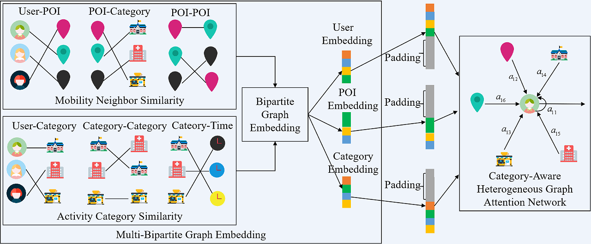

# IDGL

Code & data accompanying  paper [" Who is Your Friend: Inferring Cross-Regional
Friendship from Mobility Profiles"].


## Architecture

### Prerequisites
This code is written in python 3. You will need to install a few python packages in order to run the code.

python==3.7.10
numpy==1.20.2
pandas=1.2.5
scipy==1.6.2
tensorflow==2.4.1
networkx==2.6.1

### Run the CMGE  models
1、
* Cd into the `RELINE` folder
* Run the multi-bipartite graph embedding process to obtain user feature, POI feature and category feature.

    ```
         python user_venue_catg_embedding.py
    ```
2、
* Cd into the `data_process` folder
* Run the gat_graph to construct user-poi-category heterogenous graph

    ```
         python gat_graph.py
    ```
3、
* Cd into the `gat` folder
* Run the gat_embedding  to train  and test the model in unsupervised method
    ```
         python unsupervised_train.py
    ```


